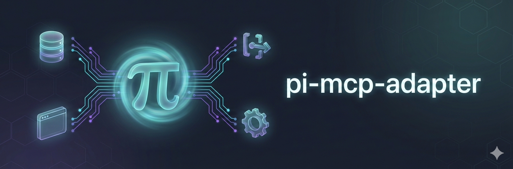

<p>
  
</p>

# Pi MCP Adapter

Use MCP servers with [Pi](https://github.com/badlogic/pi-mono/) without burning your context window.

https://github.com/user-attachments/assets/4b7c66ff-e27e-4639-b195-22c3db406a5a

## Why This Exists

Mario wrote about [why you might not need MCP](https://mariozechner.at/posts/2025-11-02-what-if-you-dont-need-mcp/). The problem: tool definitions are verbose. A single MCP server can burn 10k+ tokens, and you're paying that cost whether you use those tools or not. Connect a few servers and you've burned half your context window before the conversation starts.

His take: skip MCP entirely, write simple CLI tools instead.

But the MCP ecosystem has useful stuff - databases, browsers, APIs. This adapter gives you access without the bloat. One proxy tool (~200 tokens) instead of hundreds. The agent discovers what it needs on-demand. Servers only start when you actually use them.

## Install

```bash
pi install npm:pi-mcp-adapter
```

Restart Pi after installation.

## What happens on first run

The adapter reads standard MCP files automatically. No extra setup needed if you already have them.

| You already have... | What happens |
|---------------------|--------------|
| `.mcp.json` or `~/.config/mcp/mcp.json` | Pi uses it immediately. The first time you open `/mcp`, you'll see a short heads-up explaining which file Pi detected and that Pi only writes adapter-specific overrides to its own files. |
| Host-specific configs (Cursor, Claude Code, Codex, etc.) but no standard MCP files | Run `/mcp setup` to adopt those host configs into Pi. The setup flow shows exactly what it found, lets you pick which ones to import, and previews the exact file changes before writing. |
| Nothing configured yet | Run `/mcp setup` to scaffold a minimal `.mcp.json`, add a curated known server, quick-add RepoPrompt, or inspect what the adapter discovered on your machine. |

If you prefer the terminal, you can also run `pi-mcp-adapter init` after install to scan for host-specific configs and add missing compatibility imports to the Pi agent dir (`~/.pi/agent/mcp.json` by default, or `$PI_CODING_AGENT_DIR/mcp.json` when set).

## Quick Start

Preferred project config: `.mcp.json`

```json
{
  "mcpServers": {
    "chrome-devtools": {
      "command": "npx",
      "args": ["-y", "chrome-devtools-mcp@1.6.0"]
    }
  }
}
```

Preferred user-global shared config: `~/.config/mcp/mcp.json`. Pi also reads the tool-agnostic global paths `~/.agents/mcp.json` and `~/.agents/mcp/mcp.json`.

Pi also reads Pi-owned override files for settings and host-specific compatibility:

- `<Pi agent dir>/mcp.json` — Pi global override (`~/.pi/agent/mcp.json` by default)
- `.pi/mcp.json` — Pi project override

Host-specific configs are detected and shown by `/mcp setup` and `pi-mcp-adapter init`, but they are not loaded automatically. The normal `/mcp` panel does not scan host-specific files when `settings.hostConfigDiscovery` is `"off"`. To explicitly opt in to host-config fallback discovery, set `settings.hostConfigDiscovery` to `"on"` or run `pi-mcp-adapter init --discover-host-configs`. The default is `"off"`; `"prompt"` is available for integrations that want detection without activation. Host configs are lower precedence than every shared and Pi-owned source, and `/mcp setup` continues to offer explicit import adoption. Discovery reports source paths, provenance, and same-name conflicts; it never writes to external host files or silently launches commands from them.

Precedence is:

1. `~/.config/mcp/mcp.json`
2. `~/.agents/mcp.json`
3. `~/.agents/mcp/mcp.json`
4. `<Pi agent dir>/mcp.json`
5. `.mcp.json`
6. `.pi/mcp.json`

`/mcp disable <server>` and `/mcp enable <server>` persist only the `disabled` field in the project-local `.pi/mcp.json`, which is the highest-precedence Pi layer. Enabling removes the project flag when lower layers are enabled, or writes `false` when needed to override a disabled lower source. This applies even when the effective server came from a shared global/project file, an imported host config, or `configPath`; the source file is never rewritten and credentials are never copied. Run `/reload` after changing the flag so registered tool surfaces are refreshed. The manual equivalent is to add `{ "disabled": true }` to a server in any normal MCP config. Supplied in-memory `createMcpAdapter({ config })` configurations are isolated and do not read or write this project override; the commands are unavailable in that mode.

Servers are **lazy by default** — they won't connect until you actually call one of their tools. The adapter caches tool metadata so search and describe work without live connections.

```
mcp({ search: "screenshot" })
```
```
chrome_devtools_take_screenshot
  Take a screenshot of the page or element.

  Parameters:
    format (enum: "png", "jpeg", "webp") [default: "png"]
    fullPage (boolean) - Full page instead of viewport
```
```
mcp({ tool: "chrome_devtools_take_screenshot", args: { format: "png" } })
```

`args` can be a JSON object or a JSON string. Prefer the object form when your model handles it reliably; the string form remains supported for providers that need simpler schemas.

Two calls instead of 26 tools cluttering the context.

## Config

### File Layout

Use the shared MCP files when you want one setup to work across hosts, and Pi-owned files when you need Pi-specific overrides or settings.

| File | Purpose |
|------|---------|
| `~/.config/mcp/mcp.json` | User-global shared MCP config |
| `~/.agents/mcp.json` | User-global tool-agnostic MCP config |
| `~/.agents/mcp/mcp.json` | User-global tool-agnostic MCP config |
| `.mcp.json` | Project-local shared MCP config |
| `<Pi agent dir>/mcp.json` | Pi global override and compatibility imports (`~/.pi/agent/mcp.json` by default) |
| `.pi/mcp.json` | Pi project override |

Pi-specific files are the write targets for imported or shared global servers when Pi needs to persist adapter-only settings such as `directTools`.

### Agent Plugins

The adapter can load MCP servers from [Agent Plugins](https://agent-plugins.org/) packages when you list plugin directories in `settings.agentPluginPaths`:

```json
{
  "settings": {
    "agentPluginPaths": ["./plugins/acme-tools"]
  },
  "mcpServers": {}
}
```

Each directory must contain a valid Agent Plugins 1.0 `plugin.json`. If it also has a root `mcp.json`, the adapter loads its `mcpServers` entries and prefixes them as `<plugin>__<server>`. The loader uses the Agent Plugins transport declared by each server `type` and skips invalid entries without blocking other servers. For stdio plugin servers, `${PLUGIN_ROOT}` and `${PLUGIN_DATA}` are expanded only in `args`, `env`, and `cwd`; the adapter sets both variables for the child process and stores plugin data under the Pi agent directory.

Agent Plugins is a portable package format. Native Pi MCP config remains `.mcp.json`, `~/.config/mcp/mcp.json`, and Pi-owned overrides.

### SDK configuration

Use `createMcpAdapter` when an SDK or server integration already owns its MCP configuration:

```ts
import { createMcpAdapter } from "pi-mcp-adapter";

const extension = createMcpAdapter({
  config: {
    mcpServers: {
      docs: {
        url: "https://mcp.example.com/mcp",
        lifecycle: "eager",
      },
    },
  },
});

// Register `extension` with the host SDK.
```

The package ships TypeScript source for Pi's source-loader and SDK integrations. Use a TypeScript-capable loader/toolchain (for example `node --import tsx`) when importing the package from a standalone Node process; raw Node ESM does not execute the `.ts` entry directly.

A supplied `config` is a complete, isolated snapshot. It is not merged with files, imports, global config, project config, or `--mcp-config`, and it is never mutated. Each adapter factory and session receives its own clone, so separate integrations can use different servers and settings safely. In this mode, server status, reconnect, explicit `/mcp-auth <server>`, proxy calls, and direct tools continue to work; setup and no-argument auth/status panels report the limitation instead of discovering or writing ambient config.

With `configPath` and no `config`, the adapter keeps normal file merge behavior, and that path takes precedence over argv and `--mcp-config`. The default export keeps the normal file-based behavior. OAuth credentials are stored in the operating system credential store and keyed by the configured server name; URL binding prevents credentials from being accepted for a different server URL. `settings.oauthDir` and `MCP_OAUTH_DIR` are used only as legacy plaintext import locations for older `tokens.json` files, not as credential namespaces. CSRF state and PKCE verifiers are flow-local, so concurrent authorization flows do not share transient secrets.

Cooperating Pi extensions can use `pi-mcp-adapter/oauth` to reuse URL-bound OAuth tokens without deep-importing private files:

```ts
import { getMcpOAuthTokensForUrl, updateMcpOAuthTokensForUrl } from "pi-mcp-adapter/oauth";

const tokens = await getMcpOAuthTokensForUrl("jira", "https://jira.example.com/mcp");
updateMcpOAuthTokensForUrl("jira", "https://jira.example.com/mcp", { accessToken: "..." });
```

The public subpath exposes only token read/update helpers plus a status helper. The async read path uses the adapter's refresh logic before it returns tokens. The helpers keep secure-store storage, URL binding, refresh persistence, chunk handling, legacy import, and fail-closed credential-store errors. They do not expose client registration secrets, PKCE verifiers, or OAuth state.

### Runtime status snapshots

Extensions can subscribe to the adapter's versioned shared event-bus channel instead of parsing `/mcp` or `mcp({})` output:

```ts
import { MCP_STATUS_EVENT, type McpStatusSnapshot } from "pi-mcp-adapter";

pi.events.on(MCP_STATUS_EVENT, (snapshot) => {
  const status = snapshot as McpStatusSnapshot;
  // status.servers contains connected, cached, failed, needs-auth,
  // not-connected, or disabled entries.
});
```

The snapshot is read-only machine-readable data with copied per-server entries. It includes `totalTools`, `totalResources`, `connectedCount`, and `disabledCount`; each server includes `name`, `status`, `toolCount`, and `disabled`, with `resourceCount` when known and `failedAgoSeconds` only for an active failure. Reading status never connects a lazy server, starts authentication, or exposes SDK clients, transports, credentials, or server definitions. An initial snapshot is emitted after initialization, updates are emitted for status and metadata changes, and an empty snapshot is emitted when the session shuts down.

In the configuration examples below, `30000` is illustrative only. If `requestTimeoutMs` is omitted or set to `<= 0`, the MCP SDK default timeout is used.

### Server Options

```json
{
  "mcpServers": {
    "my-server": {
      "command": "npx",
      "args": ["-y", "some-mcp-server"],
      "lifecycle": "lazy",
      "idleTimeout": 10,
      "requestTimeoutMs": 30000
    }
  }
}
```

| Field | Description |
|-------|-------------|
| `command` | Executable for stdio transport; mutually exclusive with `url` and `socket` |
| `args` | Command arguments |
| `socket` | Explicit `rmcp-mux` Unix-domain socket path; supports `${VAR}`, `$env:VAR`, and `~` expansion and is mutually exclusive with `command` and `url` |
| `env` | Environment variables; supports `${VAR}` and `$env:VAR` interpolation. A value beginning with `!` runs a command when the stdio server connects; use `!!` for a literal leading `!`. |
| `cwd` | Working directory; supports `${VAR}`, `$env:VAR`, and `~` expansion |
| `url` | HTTP endpoint (StreamableHTTP with SSE fallback); supports raw `${VAR}` and `$env:VAR` interpolation, and missing URL variables fail before any request is sent |
| `headers` | HTTP headers; supports `${VAR}` and `$env:VAR` interpolation. A value beginning with `!` runs a command when the HTTP server connects or OAuth authenticates; use `!!` for a literal leading `!`. |
| `requestHeadersCommand` | Trusted executable run for every HTTP request. It receives a versioned JSON envelope containing `method`, `url`, and the exact `bodyBase64` on stdin, and must return a JSON object of headers on stdout. `command`, `args`, and `env` support environment interpolation. Use for caller-bound request signatures; failures stop the request. |
| `auth` | `"bearer"` or `"oauth"` |
| `oauth.grantType` | `"authorization_code"` (default) or `"client_credentials"` for non-interactive machine auth |
| `oauth.clientId` | Pre-registered OAuth client ID. MCP 2026 prefers pre-registered clients or Client ID Metadata Documents; this adapter falls back to Dynamic Client Registration when the ID is omitted and the server supports it. |
| `oauth.clientSecret` | OAuth client secret for confidential clients; a value beginning with `!` runs a command when OAuth authenticates, while `!!` escapes a literal leading `!` |
| `oauth.scope` | Requested OAuth scopes |
| `oauth.redirectUri` | Exact localhost redirect URI for browser OAuth, including port and path, for providers that pre-register callbacks |
| `oauth.clientName` | Client display name advertised during Dynamic Client Registration fallback |
| `oauth.clientUri` | Client homepage URI advertised during Dynamic Client Registration fallback. Defaults to `piConfig.clientUri` from the host's manifest when set, and is omitted rather than guessed under a rebranded host |
| `oauth.logoUri` | Client logo URL advertised during Dynamic Client Registration fallback (RFC 7591 `logo_uri`). Must be an absolute `http(s)` URL — consent screens fetch it server-side, so local paths render nothing. Omitted from the registration request when unset |
| `oauth.skipIssuerMetadataValidation` | `true` disables the OAuth authorization-server metadata issuer check for this server. This weakens OAuth mix-up protection and should only be used for known-misconfigured internal servers while their metadata is being fixed. |
| `bearerToken` / `bearerTokenEnv` | Token or env var name; `bearerToken` supports `${VAR}` and `$env:VAR` interpolation. A leading `!` in `bearerToken` runs a command when the HTTP server connects; use `!!` for a literal leading `!`. |
| `lifecycle` | `"lazy"` (default), `"eager"`, `"keep-alive"`, or `"lazy-keep-alive"` |
| `idleTimeout` | Minutes before idle disconnect (overrides global) |
| `requestTimeoutMs` | Request timeout in milliseconds for live MCP calls (overrides global; if omitted or `<= 0`, the MCP SDK default timeout is used) |
| `protocolVersion` | `"legacy"` (default), `"auto"`, or `"2026-07-28"`; modern negotiation is opt-in |
| `exposeResources` | Expose MCP resources as tools (default: true) |
| `directTools` | `true`, `string[]`, or `false` — register tools individually instead of through proxy |
| `toolPrefix` | Override global `settings.toolPrefix` for this server (`"server"`, `"short"`, `"none"`, or `"mcp"`) |
| `includeTools` | `string[]` of tool names or glob patterns to expose (matches original names like `get_screenshot`, generated resource names like `read_figjam`, and prefixed names like `figma_get_screenshot`) |
| `excludeTools` | `string[]` of tool names or glob patterns to hide (applied after `includeTools`) |
| `searchKeywords` | `{ "tool-or-glob": ["keyword", ...] }` — extra keywords that boost `mcp({ search })` ranking for matching tools; never shown to the model |
| `debug` | Show server stderr (default: false) |
| `trace` | Enable metadata-only JSONL protocol tracing for this server; payloads, prompts, tool arguments/results, authorization data, and URLs are never persisted |
| `disabled` | Keep the server visible in config and status, but prevent connections, authentication, tools, and resource calls (only literal `true` disables it) |

#### Protocol version negotiation

The adapter defaults to `protocolVersion: "legacy"`. Omitting the field uses the classic MCP initialize sequence without `server/discover` or 2026 headers, preserving compatibility with deployed 2025-era servers.

Use `"auto"` to probe for MCP 2026-07-28 and conservatively fall back to the classic handshake when the server provides legacy evidence. Set it for Cloudflare Workers `createMcpHandler` and other MCP SDK v2 stateless servers. The adapter keeps `"legacy"` as the global default for compatibility. For stdio servers, the SDK probes with a short-lived sibling process before starting the session process, so each fresh auto connection adds one process spawn and can wait for the configured request timeout. Explicit Unix sockets are custom transports and probe in place. HTTP auto negotiation uses the actual Streamable HTTP connection; the adapter falls back to legacy SSE only when the endpoint definitively rejects Streamable HTTP (for example 404/405/406/415), never for authentication failures, cancellation, timeouts, or server errors.

Use `"2026-07-28"` to pin that revision. Pinning has no legacy or SSE fallback and fails if the server does not offer the requested version.

The stable SDK handles era-specific request envelopes, result decoding, list-changed subscriptions, cancellation, and multi-round-trip sampling/elicitation. The adapter keeps strict OAuth issuer validation in every mode. Adapter-level roots support, standard MCP logging presentation, and configuration/UI for protocol cache hints are not yet implemented.

For pre-registered browser OAuth clients, set `oauth.redirectUri` to the exact callback registered with the provider, for example `"http://localhost:3118/callback"`. Dynamic clients normally omit it and use a lazy OS-assigned localhost callback port.

If an internal authorization server publishes mismatched OAuth metadata and cannot be fixed immediately, set `oauth.skipIssuerMetadataValidation: true` on that server only. This is security-weakening. It disables the RFC 8414 issuer echo check and should not be used for public or untrusted servers.

Secret values in `headers`, `bearerToken`, `oauth.clientSecret`, and stdio `env` may use a leading `!command` to obtain their value at connection or authentication time. The command runs with stdin and stderr suppressed, stdout is limited to 1 MiB and trimmed, and it must finish within 10 seconds with non-empty output; failures stop the connection or authentication flow. Commands are not run during OAuth discovery or while reading, merging, previewing, hashing, or rendering configuration. Use `!!` to escape a literal leading `!`; ordinary and escaped values retain environment interpolation.

### Shared MCP processes with rmcp-mux

To share one stdio MCP server across Pi sessions, run it under [`rmcp-mux`](https://github.com/VetCoders/rmcp-mux) and point each session at the service socket:

```json
{
  "mcpServers": {
    "memory": {
      "socket": "~/.rmcp-servers/rmcp-mux/sockets/memory.sock"
    }
  }
}
```

The adapter owns only its client socket and closes that connection when the Pi runtime stops. `rmcp-mux` owns the upstream process, request routing, initialization cache, restart policy, client limits, and socket permissions. Start and configure the mux separately; the adapter never discovers, starts, adopts, or stops its daemon. A socket is an explicit trusted local endpoint, so do not point unrelated projects or users at a mux service unless its tools, state, credentials, and filesystem access are intended to be shared.

### Remote/headless OAuth

If Pi is running on a remote server, `/mcp-auth <server>` shows a clickable authorization URL first. Open it in your local browser and approve access, then select **Yes** in Pi to open the callback input. The browser may fail to load the localhost callback page because localhost refers to your workstation; copy the full URL from its address bar and paste it into Pi. The authorization screen closes automatically instead when the browser can reach Pi's callback directly.

The same flow is available through the proxy tool for non-interactive clients. Persistent OAuth still requires an available OS credential store; on headless Linux that usually means an unlocked Secret Service/libsecret keyring. The adapter fails closed instead of falling back to plaintext credentials when the secure store is unavailable.

On Linux, if credential access fails because Pi inherited a revoked session keyring, the adapter uses a best-effort recovery path through `keyctl session - node <packaged helper>` so explicit re-authentication can write fresh credentials without killing a long-lived tmux server. This path requires `keyctl` and `node` on `PATH`; missing, locked, or otherwise unavailable credential stores still fail closed.

```js
mcp({ action: "auth-start", server: "linear-server" })
```

Open the returned authorization URL in your local browser. After approval, your browser redirects to a localhost URL. On a remote server that local page may fail to load; copy the full URL from the browser address bar anyway and complete the flow in the same Pi session:

```js
mcp({
  action: "auth-complete",
  server: "linear-server",
  args: { redirectUrl: "http://localhost:19876/callback?code=...&state=..." }
})
```

You can also pass only the `code` query parameter with `args: { code: "..." }`. Treat authorization URLs and codes as sensitive; they can grant access to the MCP server until the flow expires or completes.

### Lifecycle Modes

- **`lazy`** (default) — Don't connect at startup. Connect on first tool call. Disconnect after idle timeout. Cached metadata keeps search/list working without connections.
- **`eager`** — Connect at startup but don't auto-reconnect if the connection drops. No idle timeout by default (set `idleTimeout` explicitly to enable).
- **`keep-alive`** — Connect at startup. Auto-reconnect via health checks. No idle timeout. Use for servers you always need available.
- **`lazy-keep-alive`** — Don't connect at startup. Connect on first tool call (like `lazy`). Once spawned, never idle-shut down and auto-reconnect via health checks if the process dies (like `keep-alive`). Use for servers that are expensive to start but should stay resident after their first use.

When any enabled server uses `eager` or `keep-alive`, initialization also starts when the extension loads. This supports hosts that embed Pi programmatically and never emit `session_start`; if a session does start later, the session-owned runtime supersedes the load-time runtime.

### Settings

```json
{
  "settings": {
    "toolPrefix": "server",
    "idleTimeout": 10,
    "requestTimeoutMs": 30000,
    "showStatusIcon": true,
    "mcpFooterStatus": "full",
    "toolResultRendering": "compact",
    "collapsedResultLines": 1,
    "notifyOnStartupConnect": true,
    "warnOnLargeDirectTools": true,
    "hostConfigDiscovery": "off",
    "approveTools": ["github_delete_*", "notion_update_*"],
    "oauthDir": ".pi/mcp-oauth",
    "trace": {
      "enabled": true,
      "file": ".pi/mcp-traces/mcp.jsonl",
      "maxBytes": 262144,
      "maxEvents": 10000
    }
  },
  "mcpServers": { }
}
```

| Setting | Description |
|---------|-------------|
| `toolPrefix` | `"server"` (default), `"short"` (strips `-mcp` suffix), `"none"`, or `"mcp"` (prefixes with `mcp__`, using server-mode normalization). Per-server `toolPrefix` overrides this for that server. |
| `idleTimeout` | Global idle timeout in minutes (default: 10, 0 to disable) |
| `requestTimeoutMs` | Global request timeout in milliseconds for live MCP calls (if omitted or `<= 0`, the MCP SDK default timeout is used) |
| `showStatusIcon` | Show the plug icon in MCP status and connection text (default: `true`). Set to `false` for plain `MCP: ...` text. |
| `mcpFooterStatus` | MCP footer verbosity: `"full"` (default), `"compact"` for `MCP connected/enabled`, or `"off"` to clear the persistent footer status. `/mcp status` remains available. |
| `toolResultRendering` | MCP tool result row style: `"compact"` (default) uses self-rendered rows, or `"boxed"` restores the legacy Pi boxed tool row. |
| `collapsedResultLines` | Number of result text lines to show before expansion: `1`, `2`, or `3`. Defaults to `1` in compact mode and `3` in boxed mode. |
| `notifyOnStartupConnect` | Show successful startup connection notices (default: `true`). Set to `false` to suppress routine `MCP: N servers connected (M tools)` notices. Connection errors and authentication warnings remain visible. |
| `hostConfigDiscovery` | Host-specific config policy: `"off"` (default), `"prompt"` (detect/report only), or `"on"` (explicitly load detected host configs as the lowest-precedence fallback) |
| `agentPluginPaths` | Agent Plugins package directories to load MCP servers from. Relative paths resolve from the active project cwd. |
| `approveTools` | `true` to require approval before every MCP tool call, or an array of glob patterns such as `["github_delete_*", "notion_update_*"]`. Per-server `approveTools` overrides this. |
| `oauthDir` | Legacy OAuth `tokens.json` import directory for this MCP config. Relative paths resolve from the active project cwd. `MCP_OAUTH_DIR` still wins when set. Persistent OAuth credentials are stored in the OS credential store, not this directory. |
| `mcpServers.<name>.oauth.authorizationParams` | Extra authorization URL parameters for provider-specific OAuth extensions. Flow-owned parameters such as `client_id`, `redirect_uri`, `scope`, `state`, `code_challenge`, `response_type`, and `resource` cannot be overridden. |
| `directTools` | Global default for all servers (default: false). Per-server overrides this. |
| `warnOnLargeDirectTools` | Show the advisory when 75 or more direct tools resolve (default: `true`). Set to `false` to suppress only this advisory. |
| `freezeDirectTools` | Keep direct-tool registration stable after the initial sync so automatic reconnects and list-change notifications do not rebuild the system prompt. Use `mcp({ connect: "server" })` or `/mcp reconnect <server>` to refresh deliberately. Default: false. |
| `scriptMode` | Register the MCP-only `mcpScript` plain-JavaScript tool (default: true). Set to `false` to hide it. |
| `disableProxyTool` | Hide the `mcp` proxy tool once configured direct tools are fully available from cache. |
| `autoAuth` | Auto-run OAuth on `connect`/tool calls when a server needs auth, then retry once (default: false). |
| `sampling` | Allow MCP servers to sample through Pi models, honoring `modelPreferences.hints` before current/default fallback (default: true when UI approval is available). |
| `samplingAutoApprove` | Skip sampling confirmation prompts. Required for sampling in non-UI sessions (default: false). |
| `elicitation` | Allow MCP servers to request user input through Pi dialogs (default: true when Pi UI is available). |
| `outputGuard` | Guard oversized MCP output: `true` (default), `false`, or `{ maxBytes, maxLines, detailsMaxBytes }`. See [Output Guard](#output-guard). |
| `trace` | Opt-in metadata-only protocol tracing. Set `{ enabled: true }` globally or `trace: true` on a server. The per-session JSONL file defaults to `.pi/mcp-traces/`; `file`, `maxBytes` (default 262144), and `maxEvents` (default 10000) can be set. Raw MCP payloads, prompts, tool arguments/results, auth data, and URLs are never persisted. |

Per-server `idleTimeout`, `requestTimeoutMs`, and `approveTools` override the global settings. `debug` remains stderr display and is unrelated to protocol tracing.

### Tool Approval

Use `approveTools` when a tool should stay visible but not run without confirmation. This is useful for destructive or high-cost actions where hiding the tool would make planning harder, but running it silently is too risky.

```json
{
  "settings": {
    "approveTools": ["github_delete_*", "notion_update_*"]
  },
  "mcpServers": {
    "github": { "approveTools": ["delete_*", "merge_pull_request"] },
    "docs": { "approveTools": false }
  }
}
```

When a matching tool is called from the proxy tool, a direct MCP tool, a resource call, or an MCP UI iframe, Pi asks: **Allow once**, **Allow for session**, or **Deny**. Session approvals are kept in memory only. In headless sessions, matching calls fail closed with an `approval_required` result instead of running. `excludeTools` still removes tools entirely; `approveTools` only gates visible tools at call time.

Permission extensions can broker these decisions by listening on `pi-mcp-adapter:tool-approval-request` and claiming the request synchronously:

```ts
import {
  MCP_TOOL_APPROVAL_REQUEST_EVENT,
  type McpToolApprovalRequest,
} from "pi-mcp-adapter";

pi.events.on(MCP_TOOL_APPROVAL_REQUEST_EVENT, (request: McpToolApprovalRequest) => {
  request.claim(async () => {
    return "allow_once"; // "allow_for_session" | "deny" | "abstain"
  });
});
```

The request includes `serverName`, `originalToolName`, `prefixedToolName`, `args`, `origin`, and optional `signal`. The first synchronous claim wins. `allow_for_session` updates the same in-memory approval cache as the built-in dialog; `deny` blocks the MCP call; `abstain` or no claim preserves the fallback behavior above. Brokered approval runs for every uncached MCP call regardless of `approveTools` configuration, across proxy, direct, `mcpScript`, resource, and iframe origins.

### Output Guard

Oversized MCP tool/resource results are guarded by default so a single huge response can't blow up the model context window or the session file:

- Inline text output is capped at **50 KiB / 2,000 lines** (matching Pi's built-in `bash` guard). Larger output is truncated to a head preview and the full text is saved to a temp file whose path is included in the result, so the agent can `read`/`grep` it.
- **Image content blocks pass through unchanged** — only text output is guarded. Images are delivered to the provider as native image content.
- Binary resource blobs up to **10 MiB** are decoded to private temp files and replaced with file references. Each session is limited to **100 MiB** and **10,000 files**. The files are removed at session teardown.
- In proxy mode, `details.mcpResult` is kept raw when its JSON is **≤ 16 KiB**; larger results are replaced with a compact summary (block counts, sizes, key previews) and the raw JSON is saved to a temp file. Direct tools keep their lean details and never carry `mcpResult`.

Tune the text and details limits with the object form:

```json
{
  "settings": {
    "outputGuard": { "maxBytes": 51200, "maxLines": 2000, "detailsMaxBytes": 16384 }
  }
}
```

Set `"outputGuard": false` — or the env kill switch `MCP_OUTPUT_GUARD=0` — to disable text and details guarding. Binary resource materialization and its safety limits remain active. Output-guard spill files are created with mode `0600` under the system temp directory and are not cleaned up automatically; note that spilled MCP output may contain sensitive data.

### MCP Scripting

For multi-call MCP work, write ordinary JavaScript: discover, inspect, call, loop, filter, chain, or fan out, then return one result. Run that code with the default-on `mcpScript` tool. For a single MCP call, search, describe, status check, or auth action, use `mcp` instead. Set `settings.scriptMode` to `false` to hide the scripting tool.

The bundled `mcp-scripting` skill is a separate Pi package resource. To hide that skill while keeping the adapter extension installed, replace the package entry in Pi settings with the object form and disable package skills:

```json
{
  "packages": [
    { "source": "npm:pi-mcp-adapter", "skills": [] }
  ]
}
```

Preserve any version pin in `source` if your existing package entry has one. You can also disable package resources through `pi config`.

For example, this is the JavaScript passed as the `code` argument to `mcpScript`:

```js
const { items } = await tools.search({ query: "search issues", server: "github" });
const candidate = items[0];
if (!candidate) return { error: "No matching tool" };

const details = await tools.describe({ path: candidate.path });
if (details.error) return details;

const result = await tools.call(details.path, { query: "is:open label:bug" });
if (!result.ok) return result;
emit({ tool: details.path, completed: true });
return result.data;
```

See the bundled `mcp-scripting` skill for the complete workflow guide. The API is `await tools.search({ query, server?, limit?, offset? })`, `await tools.describe({ path })`, `tools.call(path, args)`, direct flat calls, `emit(value)`, and a captured `console`. Use ordinary JavaScript loops and Promise utilities for composition; fluent helpers such as `tools.find(...).one()`, `tools.parallel(...)`, and `tools.retry(...)` are not provided. MCP calls return `{ ok: true, data }` or `{ ok: false, error: { code, message } }`, so a failed call does not stop the rest of the script. Result details include a concise `calls` trace with each operation, its path or query, outcome, and duration. Emitted values and console output appear before the script's final return value, and the combined result uses the normal MCP output guard. The default timeout is 30 seconds; each script runs in a worker thread that is terminated at the deadline, including for infinite loops.

For a tool-restricted subagent, launch the child Pi with its tool allowlist set to `["mcpScript"]`. Have the parent discover MCP tool names with `mcp({ search: "..." })` and include the relevant prefixed names in the child's task; the child can then loop, filter, and chain those MCP calls without filesystem, shell, or edit tools. The adapter's ordinary lazy connection, authentication, output guard, abort handling, and approval gates still apply to every call.

`mcpScript` is a trusted agent-authored MCP scripting layer, not an isolation boundary. If you need isolation, run Pi in an isolated environment. It is distinct from Pi's code-mode skill: Pi's skill batches general Pi tools, while `mcpScript` exposes MCP calls only and can be the child's sole tool.

### MCP Prompts

MCP servers can advertise prompt templates alongside tools and resources. The adapter registers cached prompt definitions as Pi slash commands under `/mcp__<server>__<prompt>`, and refreshes their metadata whenever a server connects. Arguments support positional and `key=value` forms with quoting; required arguments are validated before `prompts/get` is called.

```text
/mcp__agent_board__create_plan "harden retry policy"
/mcp__agent_board__review_pipeline status=paused
/mcp prompts
```

Prompt results are flattened into one user message, preserving `[user]` and `[assistant]` role markers for multi-message results. Servers without the `prompts` capability are not probed.

### MCP Elicitation

When Pi exposes dialog-capable UI, the adapter advertises form elicitation support. Forms use Pi's stock `select()` and `input()` dialogs, validate the response, and provide a review/edit step before submission. Empty forms use one confirmation dialog. Explicit refusal maps to MCP `decline`; dismissing a dialog maps to `cancel`.

URL mode is advertised only in TUI mode. The adapter displays the requesting server, target host, and full URL, and always requires consent before opening the browser. It also handles URL-required tool errors (`-32042`) and completion notifications; after completing the browser interaction, retry the original tool call.

### Direct Tools

By default, all MCP tools are accessed through the single `mcp` proxy tool. This keeps context small but means the LLM has to discover MCP tools via proxy search. If you want specific tools to show up directly in the agent's tool list — alongside `read`, `bash`, `edit`, etc. — add `directTools` to your config.

Per-server:

```json
{
  "mcpServers": {
    "chrome-devtools": {
      "command": "npx",
      "args": ["-y", "chrome-devtools-mcp@1.6.0"],
      "directTools": true
    },
    "github": {
      "command": "npx",
      "args": ["-y", "@modelcontextprotocol/server-github"],
      "directTools": ["search_repositories", "get_file_contents"]
    },
    "huge-server": {
      "command": "npx",
      "args": ["-y", "mega-mcp@latest"]
    }
  }
}
```

| Value | Behavior |
|-------|----------|
| `true` | Register all tools from this server as individual Pi tools |
| `["tool_a", "tool_b"]` | Register only these tools (use original MCP names) |
| Omitted or `false` | Proxy only (default) |

To set a global default for all servers:

```json
{
  "settings": {
    "directTools": true
  },
  "mcpServers": {
    "huge-server": {
      "directTools": false
    }
  }
}
```

Per-server `directTools` overrides the global setting. The example above registers direct tools for every server except `huge-server`.

To expose only a subset of a noisy server, add `includeTools` on the server. Values can be exact original names, generated resource names such as `read_<resource>`, prefixed names, or simple glob patterns:

```json
{
  "mcpServers": {
    "dokploy": {
      "url": "http://localhost:3845/mcp",
      "directTools": true,
      "includeTools": ["get_*", "dokploy_list_apps"]
    }
  }
}
```

To hide specific tools while still using `directTools: true`, add `excludeTools` on the server. `excludeTools` is applied after `includeTools`:

```json
{
  "mcpServers": {
    "figma": {
      "url": "http://localhost:3845/mcp",
      "directTools": true,
      "excludeTools": ["read_figjam", "figma_get_code_connect_map"]
    }
  }
}
```

`includeTools` and `excludeTools` filter direct tools, proxy search/list/describe, and the `/mcp` panel view.

Each direct tool costs ~150-300 tokens in the system prompt (name + description + schema). Good for targeted sets of 5-20 tools. For servers with 75+ tools, stick with the proxy or pick specific tools with a `string[]`. If 75+ direct tools resolve, the adapter prints an advisory but still registers the tools you configured. Set `settings.warnOnLargeDirectTools` to `false` to suppress this advisory.

Direct tools register from the metadata cache in the Pi agent dir (`~/.pi/agent/mcp-cache.json` by default, or `$PI_CODING_AGENT_DIR/mcp-cache.json` when set), so no server connections are needed at startup. On the first session after adding `directTools` to a new server, the cache won't exist yet — tools fall back to proxy-only while the cache populates, then the extension hot-loads the refreshed direct tools into the current session. Servers that advertise MCP list-change notifications refresh the current session when their tool or resource list changes. On Pi versions that expose `pi.unregisterTool()`, stale direct tools are removed from the registry during refresh; older Pi versions still deactivate them from the active tool set. To force a refresh: `/mcp reconnect <server>`.

If prompt-cache stability matters more than automatic direct-tool hot-loading, set `settings.freezeDirectTools` to `true`. The initial direct-tool sync still runs, but later automatic reconnects, lazy-connects, and list-change notifications keep the registered tool surface unchanged. Deliberate refreshes through `mcp({ connect: "server" })` or `/mcp reconnect <server>` still update direct tools.

When you change direct-tool toggles in `/mcp`, the extension updates direct tool registration in the current session. Broader setup writes from `/mcp setup` still use Pi's normal reload flow because they can add or restructure MCP config files.

**Interactive configuration:** Run `/mcp` to open an interactive panel showing all servers with connection status, tools, and direct/proxy toggles. You can reconnect servers and toggle tools between direct and proxy from the same overlay. For OAuth, press Enter on a server that needs auth or `ctrl+a` on any OAuth server. The Save action defaults to `ctrl+s` and can be remapped with the `mcp.panel.save` keybinding.

**Guided first-run setup:** Run `/mcp setup` to inspect detected shared MCP files, adopt compatibility imports from other hosts, open discovered config paths, preview exact before/after file diffs for writes, scaffold a minimal project `.mcp.json`, add a curated known server (DeepWiki, Context7, Notion, GitHub, or Chrome DevTools), or quick-add RepoPrompt into a standard/shared MCP file.

**Subagent integration:** If you use the subagent extension, agents can request direct MCP tools in their frontmatter with `mcp:server-name` syntax. See the subagent README for details.

### MCP UI Integration

MCP servers can ship interactive UIs via the [MCP UI](https://github.com/MCP-UI-Org/mcp-ui) standard. When you call a tool that has a UI resource, the adapter opens it in a native macOS window via [Glimpse](https://github.com/hazat/glimpse) if available, otherwise falls back to the browser.

**How it works:**

1. Agent calls a tool like `launch_dashboard`
2. The tool's metadata includes `_meta.ui.resourceUri` pointing to a UI resource
3. pi-mcp-adapter fetches the UI HTML and opens it in an iframe
4. The UI can call MCP tools and send messages back to the agent

**Native rendering:** On macOS, if [Glimpse](https://github.com/hazat/glimpse) is installed (`pi install npm:glimpseui`), UIs open in a native WKWebView window instead of a browser tab. Set `MCP_UI_VIEWER=browser` to force the browser, `MCP_UI_VIEWER=glimpse` to require native rendering, or `MCP_UI_VIEWER=none` (also accepts `off` / `disabled`) to suppress the window entirely — the tool still runs and its inline result is returned to the agent, but no browser or native window opens. This is useful for headless setups, CI, or users who want the tool output delivered inline as text only. When suppressed, a one-line info notification shows the UI URL so it can still be opened manually if needed.

**Bidirectional communication:** The UI talks back. When it sends a prompt or intent, the message is stored and `triggerTurn()` wakes the agent. The agent retrieves messages via `mcp({ action: "ui-messages" })` and responds, enabling conversational UIs where the app and agent collaborate in real-time.

**Session reuse:** When the agent calls the same tool again while its UI is already open, the adapter pushes the new result to the existing window instead of replacing it. This enables live updates — the agent can refine a chart, add data, or respond to user input without losing the current view. Different tools still replace the session as before.

**Message types from UI:**

| Type | Purpose |
|------|---------|
| `prompt` | User message that triggers an agent response |
| `intent` | Structured action with name + params |
| `notify` | Fire-and-forget notification |
| `message` | Generic message payload |
| (custom) | Any other type forwarded as intent |

**Retrieving UI messages:**

```
mcp({ action: "ui-messages" })
```

Returns accumulated messages from UI sessions. Each message includes `type`, `sessionId`, `serverName`, `toolName`, and `timestamp`. Prompt messages include `prompt`, intent messages include `intent` and `params`.

**Browser controls:**

- **Cmd/Ctrl+Enter** — Complete and close
- **Escape** — Cancel and close
- **Done/Cancel buttons** — Same as keyboard shortcuts

**Technical notes:**

- Tool consent gates whether UIs can call MCP tools (never/once-per-server/always)
- `_meta.ui.visibility` controls audience: tools marked app-only stay out of the model tool list, and tools marked model-only cannot be called from the UI iframe.
- Works with both stdio and HTTP MCP servers
- Uses a local 408KB AppBridge bundle (MCP SDK + Zod) for browser↔server communication
- Enforces CSP from standard `_meta.ui.csp` and OpenAI-compatible `_meta["openai/widgetCSP"]` metadata in the response header while preserving provider HTML.

### Local Example: Interactive Visualizer

A minimal MCP UI example at `examples/interactive-visualizer` demonstrating charts, bidirectional messaging, and streaming. From that directory:

```bash
npm install
npm run build
npm run install-local
```

Restart pi, then ask the agent to show a chart — it calls `show_chart` and opens the UI in Glimpse (macOS) or the browser. Use `npm run uninstall-local` to remove the MCP entry.

### Import Existing Configs

Shared MCP files are loaded automatically. Use `imports` only for host-specific config formats that are not already covered by `.mcp.json` or `~/.config/mcp/mcp.json`.

```json
{
  "imports": ["cursor", "claude-code", "claude-desktop", "opencode"],
  "mcpServers": { }
}
```

Supported compatibility imports: `cursor`, `claude-code`, `claude-desktop`, `opencode`, `vscode`, `windsurf`, `codex`

`pi-mcp-adapter init` detects these host-specific configs and adds missing imports to the Pi agent dir config for you. The `opencode` import reads OpenCode V1 `mcp` entries from both `~/.config/opencode/opencode.json` and the project `opencode.json`, with project fields taking precedence. It is explicit-import only; OpenCode V2, inline content, managed configs, and remote discovery are not supported.

### Project Config

Prefer `.mcp.json` for project-local shared MCP config. Use `.pi/mcp.json` only when you need a Pi-specific project override. Project files override both user-global shared MCP config and Pi global overrides.

## Usage

| Mode | Example |
|------|---------|
| Status | `mcp({ })` |
| List server | `mcp({ server: "name" })` |
| Search | `mcp({ search: "screenshot navigate", limit: 12, offset: 0 })` |
| Describe | `mcp({ describe: "tool_name" })` |
| Instructions | `mcp({ instructions: "name" })` |
| Call | `mcp({ tool: "...", args: { key: "value" } })` |
| Connect | `mcp({ connect: "server-name" })` |
| UI messages | `mcp({ action: "ui-messages" })` |
| Auth start | `mcp({ action: "auth-start", server: "name" })` |
| Auth complete | `mcp({ action: "auth-complete", server: "name", args: { redirectUrl: "..." } })` |

`mcp({ connect: "server-name" })` refreshes an already connected server, so new tools, resources, prompts, and instructions can load without restarting Pi.

MCP proxy and direct-tool results use compact self-rendered rows by default. Collapsed success output shows the call title and the first result line, with a `Ctrl+O to expand` hint when more text is hidden. The full result remains available when expanded and is still returned unchanged to the model. Set `settings.toolResultRendering` to `"boxed"` to restore the legacy boxed Pi row, or set `settings.collapsedResultLines` to `2` or `3` when you want more collapsed text.

Search includes both MCP tools and Pi tools (from extensions). Pi tools appear first with `[pi tool]` prefix. Space-separated words are ranked by weighted matches across name, server, description, and any configured `searchKeywords`, then returned one page at a time (`limit` defaults to 12). Use `details.nextOffset` for the next page. Regex search is still available with `regex: true`, but regex results are paginated without ranking.

Tool names are fuzzy-matched on hyphens and underscores — `context7_resolve_library_id` finds `context7_resolve-library-id`. When `describe` or `tool` cannot resolve a name, the result includes top suggestions so the agent can correct a typo or missing prefix in the same turn.

### Search keywords

Search uses literal matching so a tool whose name and description use different vocabulary than the query won't be found. Per-server `searchKeywords` adds extra vocabulary for matching tools:

```json
{
  "mcpServers": {
    "github": {
      "command": "npx",
      "args": ["-y", "@modelcontextprotocol/server-github"],
      "searchKeywords": {
        "search_code": ["grep"],
        "*": ["gh"]
      }
    }
  }
}
```

With this config, `mcp({ search: "grep" })` finds `github_search_code` even though neither its name nor description contains that word. Similarly, `mcp({ search: "gh" })` finds all tools provided by the github server.

Keys match a tool's original name, prefixed name, or a glob (`*` applies to every tool on the server) and all matching entries combine. Keywords are weighted like description text, with an extra boost when the query exactly matches a configured phrase. They affect ranked and regex search only (including `tools.search` in `mcpScript`): they never appear in tool schemas, `describe` output, direct-tool registration, or the metadata cache, and search with keywords works offline from cached metadata.

When `includeSchemas` is enabled, search and describe render common JSON Schema parameters as compact TypeScript shapes like `{ query: string; limit?: number; }`, with the older schema formatter retained as a fallback for unsupported schemas.

For HTTP servers, failed connects run a one-request shape probe that can turn opaque transport errors into setup hints such as `endpoint returned HTML (200) — this URL does not appear to speak MCP`. Healthy connections are not probed.

Servers that provide usage guidance via the MCP `instructions` field surface it at three levels: a truncated head in the `mcp` proxy tool description itself (so the model sees it without any call), a longer preview at the end of `mcp({ server: "name" })` listings, and the full text via `mcp({ instructions: "name" })`. Instructions are captured at connect time and cached alongside tool metadata, so they stay available without a live connection.

## Commands

| Command | What it does |
|---------|--------------|
| `/mcp` | Interactive panel and first-run onboarding surface |
| `/mcp setup` | Guided setup for imports, a minimal `.mcp.json`, curated known servers, RepoPrompt quick-add, and config-path inspection |
| `/mcp tools` | List all tools |
| `/mcp prompts` | List all MCP prompts registered as slash commands |
| `/mcp reconnect` | Reconnect all servers |
| `/mcp reconnect <server>` | Connect or reconnect a single server |
| `/mcp disable <server>` | Disable a server in the project-local `.pi/mcp.json` (requires `/reload` to apply) |
| `/mcp enable <server>` | Enable through the project-local override layer (requires `/reload` to apply) |
| `/mcp logout <server>` | Clear stored OAuth credentials for a server and disconnect it |
| `/mcp-auth` | Open an OAuth server picker in interactive UI sessions |
| `/mcp-auth <server>` | OAuth setup for a specific server |

If `settings.autoAuth` is `true`, `mcp({ connect: ... })`, `mcp({ tool: ... })`, and direct tool calls automatically run OAuth when needed and retry once.

In interactive sessions, you can also authenticate from `/mcp` with `ctrl+a` or Enter on a server that needs auth. In remote/headless sessions, use the proxy tool's `auth-start` and `auth-complete` actions to copy the authorization URL locally and paste the redirect URL back into Pi. `/mcp-auth` without a server only opens a picker in the interactive UI.

### MCP output schemas

Advertised tool `outputSchema` values support JSON Schema draft-07 and 2020-12. Unstamped schemas use the SDK's 2020-12 default. Returned `structuredContent` is validated against the advertised schema for both proxy and direct-tool calls.

## How It Works

- One `mcp` tool in context (~200 tokens) instead of hundreds
- Servers are lazy by default — they connect on first tool call, not at startup
- Tool metadata is cached to disk so search/list/describe work without live connections
- Idle servers disconnect after 10 minutes (configurable), reconnect automatically on next use
- npx-based servers resolve to direct binary paths, skipping the ~143 MB npm parent process
- MCP server validates arguments, not the adapter
- Keep-alive servers get health checks and auto-reconnect
- Specific tools can be promoted from the proxy to first-class Pi tools via `directTools` config, so the LLM sees them directly instead of having to search

## Limitations

- Cross-session server sharing not yet implemented (each Pi session runs its own server processes)
- Compact MCP result rendering summarizes text, but inline images are still controlled by Pi's image display settings and may render below the compact text summary.
- Pi still owns one separator row before self-rendered tool output, so compact mode reduces adapter rendering height but cannot promise true zero-gap rows.
- MCP sampling support is text-only; context inclusion, tools, stop sequences, audio, and image content are rejected with explicit errors.
